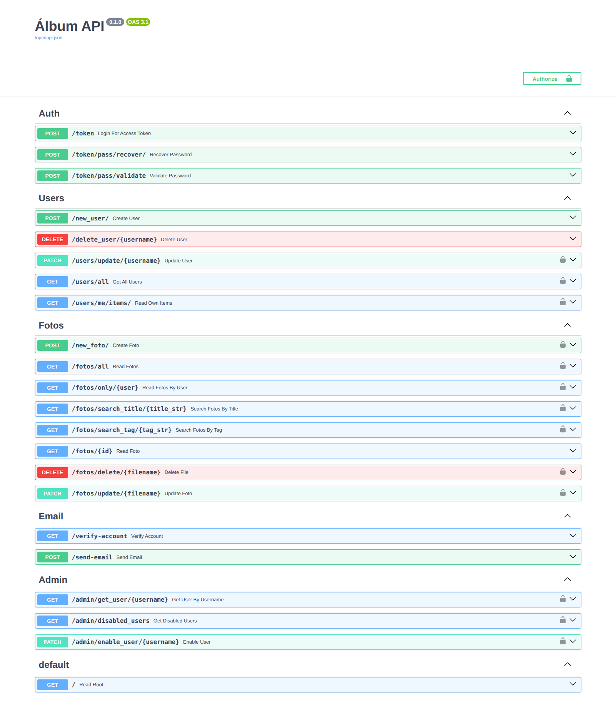
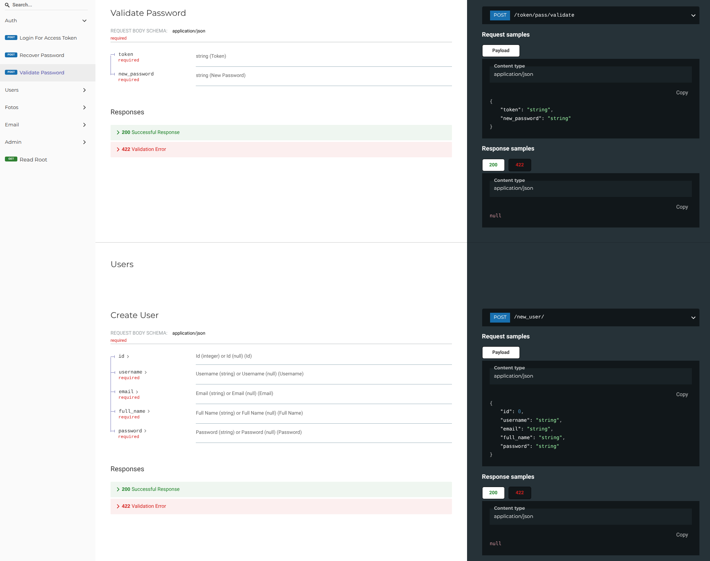

# 📸 Álbum API

> API REST desarrollada con **FastAPI** para gestión de álbumes fotográficos con sistema de doble autenticación y verificación de email.

<p align="center">
  
  
  
  
  
</p>

---

## 📑 Tabla de contenidos

- [Características](#-características)
- [Stack tecnológico](#-stack-tecnológico)
- [Capturas](#-capturas)
- [Estructura del proyecto](#-estructura-del-proyecto)
- [Instalación](#️-instalación)
- [Ejecución](#-ejecución)
- [Documentación de la API](#-documentación-de-la-api)
- [Endpoints principales](#-endpoints-principales)
- [Configuración de email](#-configuración-de-email)
- [Testing](#-testing)
- [Troubleshooting](#-troubleshooting)
- [Roadmap](#-roadmap)
- [Contribución](#-contribución)
- [Licencia](#-licencia)
- [Autor](#-autor)

---

## 🚀 Características

- ✅ Autenticación **JWT con OAuth2**
- ✅ Registro de usuarios con **verificación de email**
- ✅ Sistema de **recuperación de contraseña**
- ✅ Subida y gestión de **fotos y vídeos**
- ✅ Panel de administración para **activar usuarios**
- ✅ Búsqueda por **título y tags**
- ✅ Envío de emails con **plantillas HTML (Jinja2)**

---

## 🧰 Stack tecnológico

| Categoría        | Tecnología                          |
|------------------|-------------------------------------|
| Framework        | [FastAPI](https://fastapi.tiangolo.com/) |
| Lenguaje         | Python 3.10+                        |
| ORM              | [SQLModel](https://sqlmodel.tiangolo.com/) |
| Base de datos    | SQLite                              |
| Validación       | Pydantic v2                         |
| Autenticación    | JWT (python-jose) + OAuth2          |
| Email            | fastapi-mail + Jinja2               |
| Servidor         | Uvicorn                             |

---

## 🖼️ Capturas

> 💡 *Sustituye las rutas por tus propias capturas de pantalla.*

<p align="center">
  
  
</p>

---

## 📁 Estructura del proyecto

```
album/
├── app/
│   ├── config.py          # Configuración (JWT, CORS, email)
│   ├── database.py        # Conexión a SQLite
│   ├── dependencies.py    # Funciones de autenticación
│   ├── models/            # Modelos SQLModel (tablas)
│   │   ├── user.py
│   │   └── foto.py
│   ├── schemas/           # Esquemas Pydantic (validación)
│   │   ├── user.py
│   │   ├── foto.py
│   │   ├── token.py
│   │   └── auth.py
│   ├── services/          # Lógica de negocio
│   │   ├── auth_service.py
│   │   ├── user_service.py
│   │   ├── foto_service.py
│   │   └── email_service.py
│   └── routers/           # Endpoints agrupados por dominio
│       ├── auth.py
│       ├── users.py
│       ├── fotos.py
│       ├── email.py
│       └── admin.py
├── templates/             # Plantillas Jinja2 para emails
├── fotos/                 # Archivos subidos (no subido a Git)
├── main.py                # Punto de entrada de la app
├── .env                   # Variables de entorno (NO subido a Git)
├── .env.example           # Plantilla de variables de entorno
└── requirements.txt       # Dependencias Python
```

---

## 🛠️ Instalación

### 1. Clonar el repositorio

```bash
git clone <tu-repo>
cd album
```

### 2. Crear el entorno virtual

```bash
python -m venv .venv
source .venv/bin/activate   # Linux/Mac
# .venv\Scripts\activate    # Windows
```

### 3. Instalar dependencias

```bash
pip install -r requirements.txt
```

### 4. Configurar variables de entorno

```bash
cp .env.example .env
# Edita .env con tus credenciales de email
```

---

## 🚀 Ejecución

### Desarrollo

```bash
uvicorn main:app --reload
```

La API estará disponible en 👉 [http://localhost:8000](http://localhost:8000)

### Producción

```bash
fastapi run
```

---

## 📚 Documentación de la API

Una vez arrancado el servidor, accede a:

| Interfaz   | URL                                       |
|------------|-------------------------------------------|
| Swagger UI | [http://localhost:8000/docs](http://localhost:8000/docs) |
| ReDoc      | [http://localhost:8000/redoc](http://localhost:8000/redoc) |

---

## 🔐 Endpoints principales

<details>
<summary><b>🔑 Autenticación</b></summary>

| Método | Endpoint                        | Descripción                            |
|--------|---------------------------------|----------------------------------------|
| POST   | `/token`                        | Login                                  |
| POST   | `/token/pass/recover/`          | Recuperar contraseña                   |
| POST   | `/token/pass/validate`          | Validar token y cambiar contraseña     |

</details>

<details>
<summary><b>👤 Usuarios</b></summary>

| Método | Endpoint                        | Descripción                            |
|--------|---------------------------------|----------------------------------------|
| POST   | `/new_user/`                    | Registrar usuario                      |
| GET    | `/users/all`                    | Listar usuarios                        |
| PATCH  | `/users/update/{username}`      | Actualizar usuario                     |
| DELETE | `/delete_user/{username}`       | Borrar usuario                         |

</details>

<details>
<summary><b>📷 Fotos</b></summary>

| Método | Endpoint                                  | Descripción                 |
|--------|-------------------------------------------|-----------------------------|
| POST   | `/new_foto/`                              | Subir foto                  |
| GET    | `/fotos/all`                              | Listar todas las fotos      |
| GET    | `/fotos/only/{user}`                      | Fotos de un usuario         |
| GET    | `/fotos/search_title/{title_str}`         | Buscar por título           |
| GET    | `/fotos/search_tag/{tag_str}`             | Buscar por tag              |
| PATCH  | `/fotos/update/{filename}`                | Actualizar foto             |
| DELETE | `/fotos/delete/{filename}`                | Borrar foto                 |

</details>

<details>
<summary><b>🛡️ Administración</b></summary>

| Método | Endpoint                          | Descripción                       |
|--------|-----------------------------------|-----------------------------------|
| GET    | `/admin/disabled_users`           | Usuarios pendientes de activar    |
| PATCH  | `/admin/enable_user/{username}`   | Activar usuario                   |

</details>

---

## 📧 Configuración de email

El proyecto usa [fastapi-mail](https://sabuhish.github.io/fastapi-mail-example/) para enviar emails. Configura las variables en `.env`:

```env
MAIL_USERNAME=tu_email@gmail.com
MAIL_PASSWORD=tu_password_de_aplicacion
MAIL_FROM=tu_email@gmail.com
MAIL_PORT=587
MAIL_SERVER=smtp.gmail.com
```

> ⚠️ **Nota para Gmail:** Necesitarás crear una [contraseña de aplicación](https://myaccount.google.com/apppasswords).

---

## 🧪 Testing

Puedes probar los endpoints desde varias fuentes:

### 1. Swagger UI (recomendado)
👉 [http://localhost:8000/docs](http://localhost:8000/docs)

### 2. cURL — Ejemplos rápidos

```bash
# Login
curl -X POST http://localhost:8000/token \
  -d "username=admin&password=1234"

# Registrar usuario
curl -X POST http://localhost:8000/new_user/ \
  -H "Content-Type: application/json" \
  -d '{"username":"nuevo","email":"nuevo@mail.com","password":"1234"}'

# Listar fotos
curl http://localhost:8000/fotos/all
```

### 3. Postman / Thunder Client
Importa la colección desde la URL de Swagger.

### 4. Frontend Angular
Si tienes el frontend corriendo en 👉 [http://localhost:4200](http://localhost:4200)

---

## 🐛 Troubleshooting

| Problema                                      | Solución                                                    |
|-----------------------------------------------|-------------------------------------------------------------|
| `ModuleNotFoundError`                         | Asegúrate de tener el `.venv` activado                      |
| Error al enviar email con Gmail               | Usa una **contraseña de aplicación**, no la normal          |
| Puerto 8000 ocupado                           | Usa `uvicorn main:app --reload --port 8001`                 |
| Fotos no se guardan                           | Verifica que la carpeta `fotos/` exista y tenga permisos    |

---

## 🗺️ Roadmap

- [ ] Migrar de SQLite a PostgreSQL
- [ ] Implementar refresh tokens
- [ ] Añadir paginación en listados
- [ ] Tests unitarios con `pytest`
- [ ] Despliegue con Docker + Docker Compose
- [ ] Integración con almacenamiento en la nube (S3 / Cloudinary)

---

## 🤝 Contribución

Las contribuciones son bienvenidas 🎉

1. Haz un **fork** del proyecto
2. Crea tu rama feature (`git checkout -b feature/nueva-funcionalidad`)
3. Haz commit de tus cambios (`git commit -m 'feat: añade nueva funcionalidad'`)
4. Haz push a la rama (`git push origin feature/nueva-funcionalidad`)
5. Abre un **Pull Request**

---

## 📝 Licencia

Este proyecto es de **uso privado**. No está permitido su uso comercial sin autorización previa del autor.

---

## 👤 Autor

Desarrollado con ❤️ por **Juanra Alfaro**

<p align="left">
  <a href="https://github.com/tu-usuario" target="_blank">
    
  </a>
  <a href="https://www.linkedin.com/in/tu-perfil" target="_blank">
    
  </a>
  <a href="mailto:tu@email.com">
    
  </a>
</p>

---

<p align="center">
  <sub>¿Te ha gustado el proyecto? ¡Déjame una ⭐ en el repositorio!</sub>
</p>